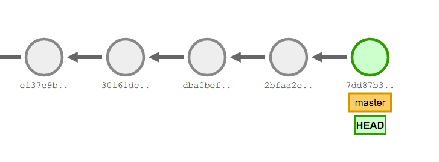

<style>
.reveal section img {
    border: none;
    box-shadow: none;
}

body {
    background-color: #ffea00;
}

.reveal,
.reveal h1,
.reveal h2,
.reveal h3 {
    color: black;
}
</style>

<!--  Logo -->


Note:
- How many did the pre-lab?
- Questions are welcome
- There are visual clients too

---

## Roadmap

- **Part 1:** Version control
    - The what, why and how of version control
    - Git basics
- **Workshop 1**
- **Part 2:** Diverging paths
    - Working in parallel
    - GitHub
- **Workshop 2**

---

## What is git?

- VCS (Version Control System)
- Industry standard

Note:
- Written for Linux

---

## "Version Control"


---

## Dropbox

- Syncs on every save           <!-- .element: class="fragment" -->
- No useful history             <!-- .element: class="fragment" -->
- No way to see related changes <!-- .element: class="fragment" -->
- Difficult to revert           <!-- .element: class="fragment" -->
- Creates conflicted copies     <!-- .element: class="fragment" -->
- Not viable for companies      <!-- .element: class="fragment" -->

Note:
- Seems to be a good idea, but no control, teammates see unfinished work even
  if you don't want to.
- Not robust enough

---

## Problems

- What changed?        <!-- .element: class="fragment" -->
- Why did it change?   <!-- .element: class="fragment" -->
- When did it change?  <!-- .element: class="fragment" -->
- Who changed it?      <!-- .element: class="fragment" -->
- How to combine work? <!-- .element: class="fragment" -->

Note:
- First four can be solved in smaller projects just by talking to each other
- Last one can be done manually

---

## Commits

**A frozen point in history**

- Changes                       <!-- .element: class="fragment" -->
- A commit message              <!-- .element: class="fragment" -->
- Who wrote it (name, email)    <!-- .element: class="fragment" -->
- When it was committed         <!-- .element: class="fragment" -->
- A link to the previous commit <!-- .element: class="fragment" -->
- A unique identifier           <!-- .element: class="fragment" -->
    - `5c12b308cbf36b182438aa480e7807a5362dcf58`

Note:
- A coherent image of what happened

---

## Basic Git history



Note:
- Series of commits
- Arrows point backwards

---

## Stages

**3 states your work can be in**

1. Working directory
2. Staging area (index)
3. Committed (history)

Note:
1. Working on your stuff
2. Packing your stuff into a box
3. Closing and labelling the box

---

<!-- .slide: data-background="#e8e8e8" -->
## Demo

```bash
git init                       # initialize git in this folder
git status                     # see what's happening, do this often
git add file.txt               # stage a file, before every commit
git diff --staged              # see what's in your staging area
git commit -m "Add test-file"  # commit the change
git log                        # see a list of your commits
git diff                       # see what changed in your working directory
```

Note:
- `git diff` will only work if it has a previous commit

---

## Tips

- Run `status` and `log` often
- Run `diff --staged` to see what you are committing
- Read and follow instructions from git
- Google

---

<!-- .slide: data-background="#49c050" -->
# Workshop 1

### github.com/alcesleo/git-101

`workshop-1.md`

---

# Part 2

**Diverging paths**

Note:
- Explain the visualizer (without origin window)
- It's fake, you don't need to add any code

---

## Refs

**Labels of commits**

- `HEAD`
- `master`
- `origin/master`
- `v1.2.3`

---

<!-- .slide: data-background="#e8e8e8" -->
## Branches

- `branch`
- `checkout`
- `checkout -b`
- `merge`

Note:
- Create a branch
- Switch to a branch
- Create and switch to a branch
- Combine a different branch into this one
    - Explain FF merges

---

<!-- .slide: data-background="#e8e8e8" -->
## Going back in time

- `checkout`
- `revert`
- `reset --hard`

Note:
- Checkout can also be to a commit, or any ref
- Create a new commit without the chosen commit
- Move your branch pointer, this makes the history after that point hard to find

---

<!-- .slide: data-background="#e8e8e8" -->
## Conflict resolution

---

<!-- .slide: data-background="#e8e8e8" -->
## Working with remotes

- `clone`
- `fetch`
- `pull`
- `push`

Note:
- Don't start using `push` until you feel comfortable with fetch+merge.
- Use `git push -u origin dev`

---

## GitHub

- Hosts your code                              <!-- .element: class="fragment" -->
- User management/permissions                  <!-- .element: class="fragment" -->
- Backup                                       <!-- .element: class="fragment" -->
- Communication/collaboration tool             <!-- .element: class="fragment" -->
- Free for open source, paid for closed source <!-- .element: class="fragment" -->

---

<!-- .slide: data-background="#e8e8e8" -->
## GitHub

Let's do remotes for real

- Create a repository and push some code <!-- .element: class="fragment" -->
- Pull Requests                          <!-- .element: class="fragment" -->
- Collaborators                          <!-- .element: class="fragment" -->

---

## Markdown

Text formatting everywhere on GitHub

    # Heading 1

    Some **bold** text and some _italic_ text,
    and some inline code `System.out.println("yo");`.

    ## Heading 2

    Code block with syntax highlighting

    ```java
    if (true) {
        System.out.println("yo");
    }
    ```

    - a
    - bullet
    - list
<!-- .element: class="nohighlight" -->

---


---

<!-- .slide: data-background="#e8e8e8" -->
## README.md

---

## How to write commit messages

- Up to 50 characters long
- Capitalized
- Written in imperative
- Without a period at the end

Note:
- Before we go to the second workshop...
- Really important, especially in teams
- GitHub cuts off the message after 50

---

## Which one is formated correctly?

1. change this to do that
2. Change this to do that.
3. Change this to do that
4. Changed this to do that

Note: 3 is correct

---

## Longer commit messages

- Leave one blank line
- Wrap at 72 characters
- Write as much as you want!

---

<!-- .slide: data-background="#49c050" -->
# Workshop 2

### github.com/alcesleo/git-101

`workshop-2.md`

Note:
- Lots of things to fiddle with, the instructions are pretty long but only the
  top part is the task, the rest is just instructions for things.
- Does not make sense to discuss all of it here, it's easier if you run into it
  and then get to fix it.
